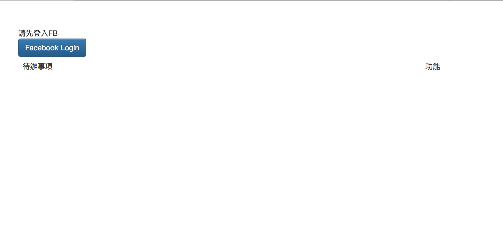
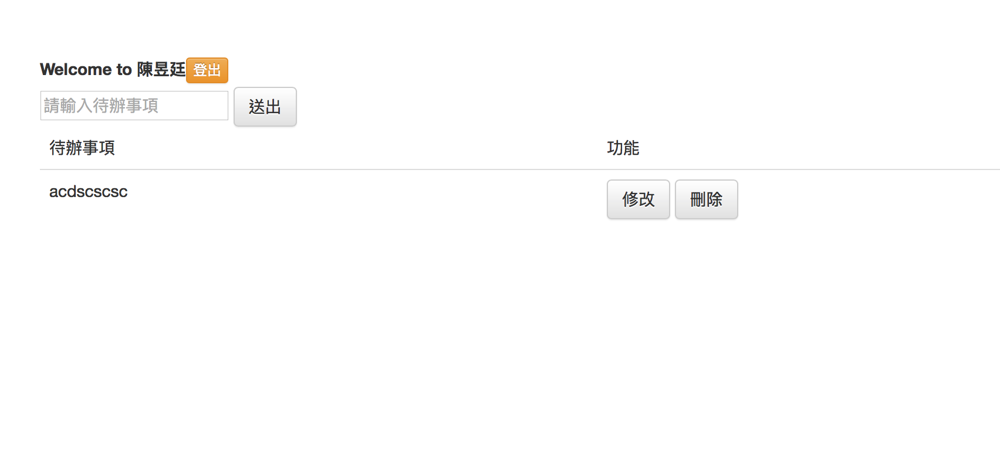

# 用 Express 和 MongoDB 寫一個 todo list（node版本:4.1.1)

練習一種語言或是 framework 最快的入門方式就是寫一個 todo list 了. 他包含了基本的 C.R.U.D. ( 新增, 讀取, 更新, 刪除 ). 這篇文章將用 Node.js 裡最通用的 framework Express 架構 application 和 MongoDB 來儲存資料.

原始檔
======

<https://github.com/y2468101216/node-wiki-gitbook/tree/master/src/todo_list>

功能
====

* 使用facebook登入, 用 session 來辨別每一問使用者
* 可以新增, 讀取, 更新, 刪除待辦事項( todo item )

開發環境
====

開發環境
開始之前請確定你已經安裝了 Node.js, Express 和 MongoDB, 如果沒有可以參考本電子書.

Node.js 套件
============

本次我們將使用node.js, Express, MongoDB, express-generator, ejs來開發

步驟
====

用 Express 的 command line 工具幫我們生成一個 project 雛形
預設的 template engine 是 jade, 在這裡我們改用比較平易近人的 ejs.

```

$ express todo_list -e --git

```

(只適用mac使用者)在專案根目錄修改 .gitignore，在最後一行加入
 
```

#mac style file
.DS_Store

```

# Welcome to Express
開啟 express server 然後打開瀏覽器瀏覽 127.0.0.1:3000 就會看到歡迎頁面.

```

$ DEBUG=todo_list npm start

```


Project 檔案結構

```

todo_list
|-- bin
|   |-- www
|  
|-- node_modules
|   |-- body-parser //負責處理post傳回來的資料
|   |-- cookie-parser //處理cookie
|   |-- debug
|   |-- ejs //view engine
|   |-- express //web server
|   |-- mongodb //db server
|   |-- morgan //紀錄http request log
|   `-- serve-favicon //db server 
|
|-- public
|   |-- images
|   |-- javascripts
|   `-- stylesheets
|       |-- style.css
|
|-- routes
|   `-- index.js
|
|-- views
|   |-- index.ejs
|   `-- error.ejs
|
|-- .gitignore
|
|-- app.js
|
`-- package.json

```
* bin - 邏輯檔
* node_modules  - 包含所有 project 相關套件.
* public - 包含所有靜態檔案.
* routes - 路由檔.
* views - 包含 action views, partials 還有 layouts.
* app.js - 包含設定, middlewares, 和 routes 的分配.
* package.json - 相關套件的設定檔.

# 安裝mongoDB

打開package.json，在dependencies插入兩行

```json

 {
  "name": "todo_list",
  "version": "0.0.0",
  "private": true,
  "scripts": {
    "start": "node ./bin/www"
  },
  "dependencies": {
    "body-parser": "~1.13.2",
    "cookie-parser": "~1.3.5",
    "debug": "~2.2.0",
    "ejs": "~2.3.3",
    "express": "~4.13.1",
    "morgan": "~1.6.1",
    "serve-favicon": "~2.3.0",
    "mongodb": "~2.0.0"
  }
}
 
```

然後npm會自動讀取package.json
```

npm install

```

就會幫我們mongoDB裝好了

# 安裝測試工具-mocha

我們是好孩子，所以要寫unit test，詳細的介紹在NODE_TEST裡

```

$ npm install -g mocha

```

MongoDB CRUD
=========================

我們需要先寫CRUD的測試

新增一個test目錄並建立一個dbCRUDTest.js的檔案，程式碼如下:

```javascript

var dbConnect = require('../bin/dbConnect.js');
var dbConnectTest = new dbConnect();
var crud = require('../bin/dbCRUD.js');
var crudTest = new crud();
var assert = require('assert');

describe('dbTest', function () {
	before('create Test Collection', function (done) {
		console.log('createTestCollection');
		dbConnectTest.connect(function (db) {
			db.createCollection('event', function (err, results) {
				db.close();
				assert.equal(null, err);
				done();
			});
		});
	});

	it('connect Should Be Success', function (done) {
		dbConnectTest.connect(function (db) {
			db.admin().serverInfo(function (err, results) {
				db.close();
				assert.equal(null, err);
				done();
			});
		});
	});
		
	it('insert Should Be Success', function (done) {
		dbConnectTest.connect(function (db) {
			crudTest.insert({ userId: '1234', event: 'test' }, db, function (err, results) {
				db.close();
				if (err) throw err;
				done();
			});
		});
	});

	it('select Should Not Be 0', function (done) {
		dbConnectTest.connect(function (db) {
			crudTest.select(null, db, function (cursor) {
				cursor.count(function (err, count) {
					db.close();
					assert.equal(null, err);
					assert.notEqual(count, 0);
					done();
				});

			});
		});
	});

	it('update Should Be Success. But Update Nothing', function (done) {
		dbConnectTest.connect(function (db) {
			crudTest.update({ _id: 1, event: 'test2', userId: '1234' }, db, function (err, results) {
				db.close();
				assert.equal(null, err);
				assert.equal(0,results.modifiedCount)
				done();
			});
		});
	});

	it('delete Should Be Success. But Delete Nothing', function (done) {
		dbConnectTest.connect(function (db) {
			crudTest.delete({ _id: 1, userId: '1234' }, db, function (err, results) {
				db.close();
				assert.equal(null, err);
				assert.equal(0,results.deletedCount)
				done();
			});
		});
	});

	after('drop Test Collection', function (done) {
		console.log('dropTestCollection');
		dbConnectTest.connect(function (db) {
			db.dropCollection('event', function (err, results) {
				db.close();
				assert.equal(null, err);
				done();
			});
		});
		
	});
});

```
做測試之前我們需要先把mongodb打開

在 Ubuntu 上 MongoDB 開機後便會自動開啟. 在 Mac 上你需要手動輸入下面的指令.

```

$ mongod

```

在bin/下新增一個檔案叫做 dbConnect.js 來設定 MongoDB

```javascript

/**
 * Name:dbConnect.js 
 * Purpose:connect mongodb 
 * Author:Yun 
 * Version:1.0
 * Update:2015-10-15
 */

module.exports = function () {
	var MongoClient = require('mongodb').MongoClient;//mongodb client
	var url = 'mongodb://localhost:27017/todo_list_test';// mongodb://登入url/db名稱
	
	this.connect = function (callback) {
		MongoClient.connect(url, function (err, db) {
			if (err) {
				throw err;
			} else {
				callback(db);
			}
		});
	}	
}

```

在bin/下新增一個檔案叫做 dbCRUD.js，這是給todo_list讀寫資料庫用的。

```javascript

/**
 * Name:dbCRUD.js 
 * Purpose:todo_list CRUD
 * Author:Yun 
 * Version:1.0
 * Update:2015-10-15
 */

module.exports = function () {
    
}
 
```

進行第一次測試，請切換到todo_list目錄底下，執行以下指令

```

$ mocha test/dbCRUDTest.js

```


如上圖所示，你可以注意到雖然connect過了，但是CRUD沒有過，因為我們還未定義dbCRUD.js的function，讓我們把洞補起來。

修改dbCRUD.js如下

```javascript

/**
 * Name:dbCRUD.js 
 * Purpose:todo_list CRUD
 * Author:Yun 
 * Version:1.0
 * Update:2015-10-15
 */

module.exports = function () {

	this.select = function (findCondition, db, callback) {
		var cursor = db.collection('event').find(findCondition);
		callback(cursor);
	}
	
	this.insert = function (insertObject, db, callback) {
		db.collection('event').insertOne({event:insertObject.event, userId:insertObject.userId}, function (err, results) {
			callback(err, results);
		});
	}

	this.update = function (updateObject, db, callback) {
		var ObjectID = require('mongodb').ObjectID
		var id = new ObjectID(updateObject.id);
		db.collection('event').updateOne({_id:id, userId:updateObject.userId}, {$set:{event:updateObject.event}} ,function (err, results) {
			callback(err, results);
		});
	}
	
	this.delete = function (deleteObject, db, callback) {
		var ObjectID = require('mongodb').ObjectID
		var id = new ObjectID(deleteObject.id);
		db.collection('event').deleteOne({_id:id, userId:deleteObject.userId}, function (err, results) {
			callback(err, results);
		});
	}
}

```

執行第二次測試如下

```

$ mocha test/dbCRUDTest.js

```


這次就全數通過了。

* 備註

這個測試，有兩個不好的地方。

1. connect跟所有相依在一起了
2. insert跟select相依在一起了

理論上應該要新增一個假的db instance去做測試，但是因為作者懶惰的關係，所以決定這樣寫。

修改 index.js 使他可以查詢
---------------

我們需要調整index.js，讓他可以帶查詢的結果

index.js修改程式碼如下：

```javascript

/**
 * Name:index.js 
 * Purpose:show index.html
 * Author:Yun 
 * Version:1.0
 * Update:2015-10-20
 */

var express = require('express');
var router = express.Router();

var dbConnect = require('../bin/dbConnect.js');
var dbConn = new dbConnect();

var dbCRUD = require('../bin/dbCRUD.js');
var dbCRUDMethod = new dbCRUD();

/* GET home page. */
router.get('/', function (req, res, next) {
  dbConn.connect(function (db) {
    dbCRUDMethod.select(null, db, function (cursor) {
      var data = [];
      cursor.forEach(function(result){
        data.push(result);
        db.close();
      },function(err){
        if(err) throw err;
        res.render('index', { title: 'Express', cursor: data });
      });
     
    });
  });

});

module.exports = router;

```

修改index.ejs如下:

```html

<!DOCTYPE html>
<html>
  <head>
    <title><%= title %></title>
    <link rel='stylesheet' href='/stylesheets/style.css' />
  </head>
  <body>
    <h1><%= title %></h1>
    <p>Welcome to <%= title %></p>
    <ul>
    <% cursor.forEach(function(data){ %>
      <%= data.event %>
    <% }); %>
  </ul>
  </body>
</html>


```

執行:

```
DEBUG=todo_list npm start
```

連<http://localhost:3000/>即可看到成果


這時還沒任何顯示任何資料，因為資料庫裡尚未儲存任何資料。

# 修改todo_list使其有新增功能

```html

<!DOCTYPE html>
<html>

<head>
  <title>
    <%= title %>
  </title>
  <link rel='stylesheet' href='/stylesheets/style.css' />
</head>

<body>
  <p>Welcome to <%= title %></p>
  <form method="post" action="insert">
    <input type="text" value="" placeholder="請輸入代辦事項" />
    <button type="submit" value="">送出</button>
  </form>
  <ul>
    <% cursor.forEach(function(data){ %>
      <%= data.event %>
        <% }); %>
  </ul>
</body>

</html>

```

app.js:

```javascript

var express = require('express');
var path = require('path');
var favicon = require('serve-favicon');
var logger = require('morgan');
var cookieParser = require('cookie-parser');
var bodyParser = require('body-parser');

var routes = require('./routes/index');
var users = require('./routes/users');

var app = express();

// view engine setup
app.set('views', path.join(__dirname, 'views'));
app.set('view engine', 'ejs');

// uncomment after placing your favicon in /public
//app.use(favicon(path.join(__dirname, 'public', 'favicon.ico')));
app.use(logger('dev'));
app.use(bodyParser.json());
app.use(bodyParser.urlencoded({ extended: false }));
app.use(cookieParser());
app.use(express.static(path.join(__dirname, 'public')));

app.use('/', routes);
app.use('/users', users);
app.use('/control/:method', control);

// catch 404 and forward to error handler
app.use(function(req, res, next) {
  var err = new Error('Not Found');
  err.status = 404;
  next(err);
});

// error handlers

// development error handler
// will print stacktrace
if (app.get('env') === 'development') {
  app.use(function(err, req, res, next) {
    res.status(err.status || 500);
    res.render('error', {
      message: err.message,
      error: err
    });
  });
}

// production error handler
// no stacktraces leaked to user
app.use(function(err, req, res, next) {
  res.status(err.status || 500);
  res.render('error', {
    message: err.message,
    error: {}
  });
});


module.exports = app;

```

新增一個control.js檔案在routes底下

```javascript
/**
 * Name:control.js 
 * Purpose:update insert delete todo_list
 * Author:Yun 
 * Version:1.0
 * Update:2015-10-21
 */

var express = require('express');
var router = express.Router();

/* insert home page. */
router.post('/', function (req, res, next) {
  var Db = require('../bin/DbConnect.js');
  var dbConn = new Db();
  var dbCRUD = require('../bin/dbCRUD.js');
  var dbCRUDControl = new dbCRUD();
  dbConn.connect(function (db) {
    switch (req.query.method) {
      case 'insert':
        dbCRUDControl.insert({ event: req.body.event, userId: 1234 }, db, function (err, results) {
          if (err) throw err;
          db.close();
          res.redirect('/');
        });
        break;
      default:
        res.redirect('/');
        break;
    }
  });
});

module.exports = router;

```

執行:

```
DEBUG=todo_list npm start
```

連<http://localhost:3000/>即可看到成果


# 完成修改、刪除功能。

index.ejs:

```html

<!DOCTYPE html>
<html>

<head>
  <title>
    <%= title %>
  </title>
  <link rel='stylesheet' href='/stylesheets/style.css' />
  <!-- Latest compiled and minified CSS -->
  <link rel="stylesheet" href="https://maxcdn.bootstrapcdn.com/bootstrap/3.3.5/css/bootstrap.min.css">

  <!-- Optional theme -->
  <link rel="stylesheet" href="https://maxcdn.bootstrapcdn.com/bootstrap/3.3.5/css/bootstrap-theme.min.css">

  <!-- Latest jquery  -->
  <script src="https://code.jquery.com/jquery-2.1.4.min.js"></script>

  <!-- Latest compiled and minified JavaScript -->
  <script src="https://maxcdn.bootstrapcdn.com/bootstrap/3.3.5/js/bootstrap.min.js"></script>
</head>

<body>
  <div class="row">
    <p>Welcome to
      <%= title %>
    </p>
  </div>
  <div class="row">
    <form method="post" action="control?method=insert" class="form-inline">
      <input type="text" name="event" value="" placeholder="請輸入代辦事項" />
      <button type="submit" class="btn btn-primary" value="">送出</button>
    </form>
  </div>
  <div class="row">
    <table class="table">
      <thead>
        <tr>
          <td>待辦事項</td>
          <td>功能</td>
        </tr>
      </thead>
      <tbody
      <% cursor.forEach(function(data){ %>
        <tr>
          <td>
            <%= data.event %>
          </td>
          <td>
            <button type="button" class="btn btn-default" onclick="showModal('<%= data.event %>','<%= data._id %>','update')">修改</button>
            <button type="button" class="btn btn-default" onclick="showModal('','<%= data._id %>','delete')">刪除</button>
          </td>
        </tr>
        <% }); %>
      </tbody>
    </table>
  </div>

  <!-- modal for update -->
  <div class="modal fade" id="updateModal">
    <div class="modal-dialog">
      <div class="modal-content">
        <div class="modal-header">
          <button type="button" class="close" data-dismiss="modal" aria-label="Close"><span aria-hidden="true">&times;</span></button>
          <h4 class="modal-title">修改代辦事項</h4>
        </div>
        <form method="post" action="control?method=update">
          <div class="modal-body">
            <input type="text" value="" name="updateImportEventText" id="updateImportEventText" />
            <input type="hidden" value="" name="updateImportEventId" id="updateImportEventId" />
          </div>
          <div class="modal-footer">
            <button type="button" class="btn btn-default" data-dismiss="modal">Close</button>
            <button type="submit" class="btn btn-warning">Save</button>
          </div>
        </form>
      </div>
      <!-- /.modal-content -->
    </div>
    <!-- /.modal-dialog -->
  </div>
  <!-- /.modal -->

  <!-- modal for delete -->
  <div class="modal fade" id="deleteModal">
    <div class="modal-dialog">
      <div class="modal-content">
        <div class="modal-header">
          <button type="button" class="close" data-dismiss="modal" aria-label="Close"><span aria-hidden="true">&times;</span></button>
          <h4 class="modal-title">刪除代辦事項</h4>
        </div>
        <form method="post" action="control?method=delete">
          <div class="modal-body">
            <label>是否刪除</label>
            <input type="hidden" value="" name="deleteImportEventId" id="deleteImportEventId" />
          </div>
          <div class="modal-footer">
            <button type="button" class="btn btn-default" data-dismiss="modal">否</button>
            <button type="submit" class="btn btn-warning">是</button>
          </div>
        </form>
      </div>
      <!-- /.modal-content -->
    </div>
    <!-- /.modal-dialog -->
  </div>
  <!-- /.modal -->
</body>

<script>
  function showModal(event, id, method){
    switch (method){
      case 'update':
      $('#updateImportEventId').val(id);
      $('#updateImportEventText').val(event);
      $('#updateModal').modal('show');
      break;
      case 'delete':
      $('#deleteImportEventId').val(id);
      $('#deleteModal').modal('show');
      break;
    }
  }

</script>

</html>

```

control.js:

```javascript

/**
 * Name:control.js 
 * Purpose:update insert delete todo_list
 * Author:Yun 
 * Version:1.0
 * Update:2015-10-21
 */

var express = require('express');
var router = express.Router();

/* insert home page. */
router.post('/', function (req, res, next) {
  var Db = require('../bin/DbConnect.js');
  var dbConn = new Db();
  var dbCRUD = require('../bin/dbCRUD.js');
  var dbCRUDControl = new dbCRUD();
  dbConn.connect(function (db) {
    switch (req.query.method) {
      case 'insert':
        dbCRUDControl.insert({ event: req.body.event, userId: 1234 }, db, function (err, results) {
          if (err) throw err;
          db.close();
          res.redirect('/');
        });
        break;
      case 'update':
        dbCRUDControl.update({ event: req.body.updateImportEventText, id: req.body.updateImportEventId, userId: 1234 }, db, function (err, results) {
          if (err) throw err;
          db.close();
          res.redirect('/');
        });
        break;
      case 'delete':
        dbCRUDControl.delete({ id: req.body.deleteImportEventId, userId: 1234 }, db, function (err, results) {
          if (err) throw err;
          db.close();
          res.redirect('/');
        });
        break;
      default:
        res.redirect('/');
        break;
    }
  });
});

module.exports = router;

```

我在html裡引入了bootstrap跟jquery以增進使用者體驗跟美化。
並且在control.js裡增加了delete跟update方法。

你可以試著運行看看結果如何。


# passport.js 安裝

你可以注意到我們的userid都是寫死的，這樣無法區別使用者，所以這邊我們將運用passport.js做facebook登入。

修改package.json:

```json

{
  "name": "todo_list",
  "version": "0.0.0",
  "private": true,
  "scripts": {
    "start": "node ./bin/www"
  },
  "dependencies": {
    "body-parser": "~1.13.2",
    "cookie-parser": "~1.3.5",
    "debug": "~2.2.0",
    "ejs": "~2.3.3",
    "express": "~4.13.1",
    "morgan": "~1.6.1",
    "serve-favicon": "~2.3.0",
    "mongodb": "~2.0.0",
    "cookie-session":"~2.0.0",
    "passport":"~0.3.0",
    "passport-facebook":"2.0.0"
  }
}

```

passport需要session儲存使用者資訊，這裡我們選擇cookie-session，還需要擴充模組以支援facebook登入

執行:

```

$ npm install

```

* facebook APP申請

登入<https://developers.facebook.com>，點選上方選單的My apps->Add a New App


點選Settings，切換到上方的Advanced分頁。


往下尋找Valid OAuth redirect URIs，填寫如圖


拉到最下按save就完成了。

* 附註

如果你想要提供給其他人登入的話必須將下圖的電子郵件填寫完畢後


status & Review 中的 status 點選No使其變成Yes


app.js:

```javascript

var express = require('express');
var path = require('path');
var favicon = require('serve-favicon');
var logger = require('morgan');
var cookieParser = require('cookie-parser');
var bodyParser = require('body-parser');
var cookieSession = require('cookie-session');

//facebbok login
var passport = require('passport');
var FacebookStrategy = require('passport-facebook').Strategy

var FACEBOOK_APP_ID = "--insert-facebook-app-id-here--"
var FACEBOOK_APP_SECRET = "--insert-facebook-app-secret-here--";

// Passport session setup.
//   To support persistent login sessions, Passport needs to be able to
//   serialize users into and deserialize users out of the session.  Typically,
//   this will be as simple as storing the user ID when serializing, and finding
//   the user by ID when deserializing.  However, since this example does not
//   have a database of user records, the complete Facebook profile is serialized
//   and deserialized.
passport.serializeUser(function (user, done) {
  done(null, user);
});

passport.deserializeUser(function (obj, done) {
  done(null, obj);
});


// Use the FacebookStrategy within Passport.
//   Strategies in Passport require a `verify` function, which accept
//   credentials (in this case, an accessToken, refreshToken, and Facebook
//   profile), and invoke a callback with a user object.
passport.use(new FacebookStrategy({
  clientID: FACEBOOK_APP_ID,
  clientSecret: FACEBOOK_APP_SECRET,
  callbackURL: "http://localhost:3000/auth/facebook/callback"
},
  function (accessToken, refreshToken, profile, done) {
    // asynchronous verification, for effect...
    process.nextTick(function () {
      
      // To keep the example simple, the user's Facebook profile is returned to
      // represent the logged-in user.  In a typical application, you would want
      // to associate the Facebook account with a user record in your database,
      // and return that user instead.
      return done(null, profile);
    });
  }
  ));

var routes = require('./routes/index');
var users = require('./routes/users');
var control = require('./routes/control');

var app = express();

// view engine setup
app.set('views', path.join(__dirname, 'views'));
app.set('view engine', 'ejs');

// uncomment after placing your favicon in /public
//app.use(favicon(path.join(__dirname, 'public', 'favicon.ico')));
app.use(logger('dev'));
app.use(bodyParser.json());
app.use(bodyParser.urlencoded({ extended: false }));
app.use(cookieParser());
app.use(cookieSession({ secret: 'I am your FATHER' }));
app.use(express.static(path.join(__dirname, 'public')));
app.use(passport.initialize());
app.use(passport.session());


app.use('/', routes);
app.use('/users', users);
app.use('/control', control);

// GET /auth/facebook
app.get('/auth/facebook',
  passport.authenticate('facebook'),
  function (req, res) {
    // The request will be redirected to Facebook for authentication, so this
    // function will not be called.
  });

// GET /auth/facebook/callback
app.get('/auth/facebook/callback',
  passport.authenticate('facebook', { failureRedirect: '/' }),
  function (req, res) {
    res.redirect('/');
  });

app.get('/logout', function (req, res) {
  req.logout();
  res.redirect('/');
});

// catch 404 and forward to error handler
app.use(function (req, res, next) {
  var err = new Error('Not Found');
  err.status = 404;
  next(err);
});

// error handlers

// development error handler
// will print stacktrace
if (app.get('env') === 'development') {
  app.use(function (err, req, res, next) {
    res.status(err.status || 500);
    res.render('error', {
      message: err.message,
      error: err
    });
  });
}

// production error handler
// no stacktraces leaked to user
app.use(function (err, req, res, next) {
  res.status(err.status || 500);
  res.render('error', {
    message: err.message,
    error: {}
  });
});

module.exports = app;

```

index.ejs

```html

<!DOCTYPE html>
<html>

<head>
  <title>
    待辦事項
  </title>
  <link rel='stylesheet' href='/stylesheets/style.css' />
  <!-- Latest compiled and minified CSS -->
  <link rel="stylesheet" href="https://maxcdn.bootstrapcdn.com/bootstrap/3.3.5/css/bootstrap.min.css">

  <!-- Optional theme -->
  <link rel="stylesheet" href="https://maxcdn.bootstrapcdn.com/bootstrap/3.3.5/css/bootstrap-theme.min.css">

  <!-- Latest jquery  -->
  <script src="https://code.jquery.com/jquery-2.1.4.min.js"></script>

  <!-- Latest compiled and minified JavaScript -->
  <script src="https://maxcdn.bootstrapcdn.com/bootstrap/3.3.5/js/bootstrap.min.js"></script>
</head>

<body>
  <% if (name) { %>
  <div class="row">
    <label>Welcome to <%= name %></label><a class="btn btn-warning btn-xs" href="/logout">登出</a>
  </div>
  <div class="row">
    <form method="post" action="control?method=insert" class="form-inline">
      <input type="text" name="event" value="" placeholder="請輸入待辦事項" />
      <button type="submit" id="submit" class="btn btn-default" value="">送出</button>
    </form>
  </div>
  <% }else{ %>
  <div class="row" id="LoginMessage">
    <div>請先登入FB</div>
    <div>
      <a class="btn btn-primary" href="/auth/facebook">
      Facebook Login
      </a>
    </div>
  </div>
  <% } %>
  <div class="row">
    <table class="table">
      <thead>
        <tr>
          <td>待辦事項</td>
          <td>功能</td>
        </tr>
      </thead>
      <tbody>
        <% if (cursor) { %>
        <% cursor.forEach(function(data){ %>
        <tr>
          <td>
            <%= data.event %>
          </td>
          <td>
            <button type="button" class="btn btn-default" onclick="showModal('<%= data.event %>','<%= data._id %>','update')">修改</button>
            <button type="button" class="btn btn-default" onclick="showModal('','<%= data._id %>','delete')">刪除</button>
          </td>
        </tr>
        <% }); %>
        <% } %>
      </tbody>
    </table>
  </div>

  <!-- modal for update -->
  <div class="modal fade" id="updateModal">
    <div class="modal-dialog">
      <div class="modal-content">
        <div class="modal-header">
          <button type="button" class="close" data-dismiss="modal" aria-label="Close"><span aria-hidden="true">&times;</span></button>
          <h4 class="modal-title">修改代辦事項</h4>
        </div>
        <form method="post" action="control?method=update">
          <div class="modal-body">
            <input type="text" value="" name="updateImportEventText" id="updateImportEventText" />
            <input type="hidden" value="" name="updateImportEventId" id="updateImportEventId" />
          </div>
          <div class="modal-footer">
            <button type="button" class="btn btn-default" data-dismiss="modal">Close</button>
            <button type="submit" class="btn btn-warning">Save</button>
          </div>
        </form>
      </div>
      <!-- /.modal-content -->
    </div>
    <!-- /.modal-dialog -->
  </div>
  <!-- /.modal -->

  <!-- modal for delete -->
  <div class="modal fade" id="deleteModal">
    <div class="modal-dialog">
      <div class="modal-content">
        <div class="modal-header">
          <button type="button" class="close" data-dismiss="modal" aria-label="Close"><span aria-hidden="true">&times;</span></button>
          <h4 class="modal-title">刪除代辦事項</h4>
        </div>
        <form method="post" action="control?method=delete">
          <div class="modal-body">
            <label>是否刪除</label>
            <input type="hidden" value="" name="deleteImportEventId" id="deleteImportEventId" />
          </div>
          <div class="modal-footer">
            <button type="button" class="btn btn-default" data-dismiss="modal">否</button>
            <button type="submit" class="btn btn-warning">是</button>
          </div>
        </form>
      </div>
      <!-- /.modal-content -->
    </div>
    <!-- /.modal-dialog -->
  </div>
  <!-- /.modal -->
</body>

<script>
  function showModal(event, id, method){
    switch (method){
      case 'update':
      $('#updateImportEventId').val(id);
      $('#updateImportEventText').val(event);
      $('#updateModal').modal('show');
      break;
      case 'delete':
      $('#deleteImportEventId').val(id);
      $('#deleteModal').modal('show');
      break;
    }
  }

</script>

</html>

```

index.js

```javascript

/**
 * Name:index.js 
 * Purpose:show index.html
 * Author:Yun 
 * Version:1.0
 * Update:2015-10-20
 */

var express = require('express');
var router = express.Router();

var dbConnect = require('../bin/dbConnect.js');
var dbConn = new dbConnect();

var dbCRUD = require('../bin/dbCRUD.js');
var dbCRUDMethod = new dbCRUD();


/* GET home page. */
router.get('/', function (req, res) {
  dbConn.connect(function (db) {
    if (typeof req.user == 'undefined') {
      res.render('index', { name: false, cursor: false });
    } else {
      dbCRUDMethod.select({userId:req.user.id}, db, function (cursor) {
        var data = [];
        cursor.forEach(function (result) {
          data.push(result);
          db.close();
        }, function (err) {
          if (err) throw err;
          res.render('index', { name: req.user.displayName, cursor: data });

        });

      });
    }

  });

});

module.exports = router;

```

control.js

```javascript

/**
 * Name:control.js 
 * Purpose:update insert delete todo_list
 * Author:Yun 
 * Version:1.0
 * Update:2015-10-21
 */

var express = require('express');
var router = express.Router();

/* insert home page. */
router.post('/', function (req, res, next) {
  var Db = require('../bin/DbConnect.js');
  var dbConn = new Db();
  var dbCRUD = require('../bin/dbCRUD.js');
  var dbCRUDControl = new dbCRUD();
  if (typeof req.user != 'undefined') {
    dbConn.connect(function (db) {
      switch (req.query.method) {
        case 'insert':
          dbCRUDControl.insert({ event: req.body.event, userId: req.user.id }, db, function (err, results) {
            if (err) throw err;
            db.close();
            res.redirect('/');
          });
          break;
        case 'update':
          dbCRUDControl.update({ event: req.body.updateImportEventText, id: req.body.updateImportEventId, userId: req.user.id }, db, function (err, results) {
            if (err) throw err;
            db.close();
            res.redirect('/');
          });
          break;
        case 'delete':
          dbCRUDControl.delete({ id: req.body.deleteImportEventId, userId: req.user.id }, db, function (err, results) {
            if (err) throw err;
            db.close();
            res.redirect('/');
          });
          break;
        default:
          res.redirect('/');
          break;
      }
    });
  } else {
    res.redirect('/');
  }
});

module.exports = router;

```

最後畫面:




完成
===============

恭喜你，你已經跨出了node.js的第一步，歡迎你加入node.js這個大社群。
